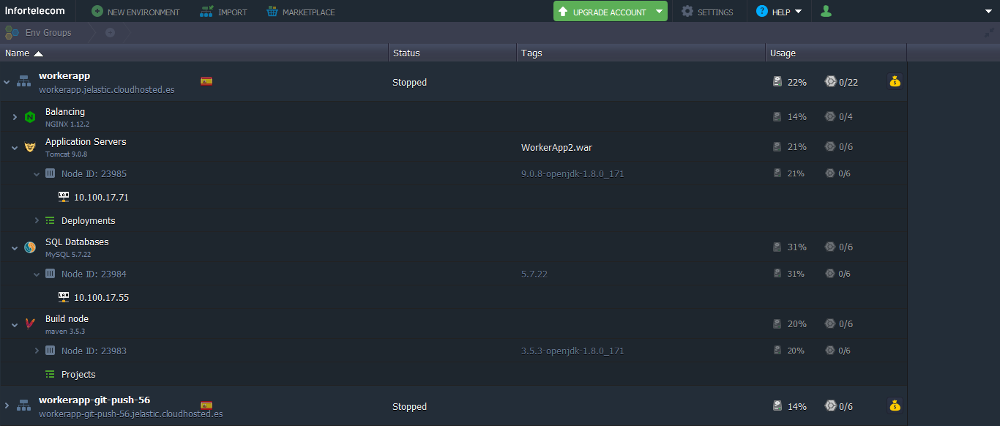
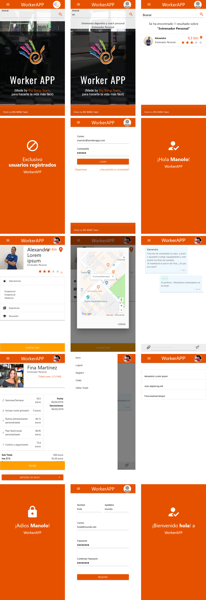
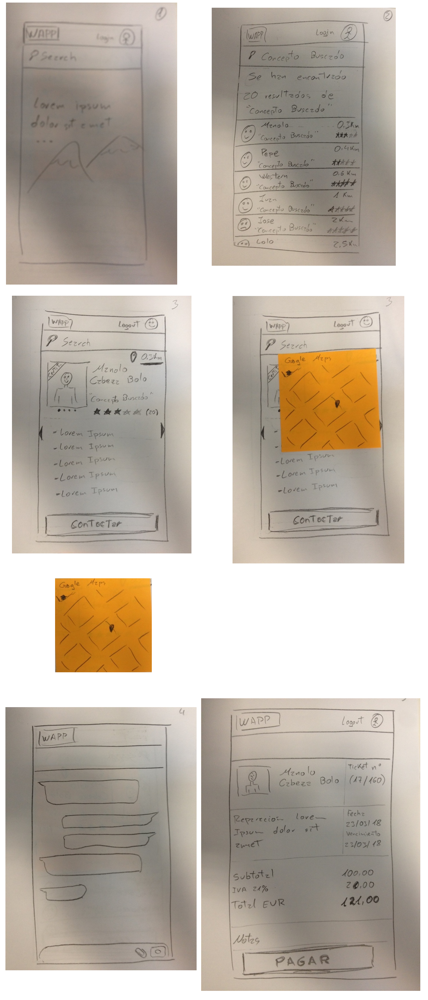

# WorkerApp2

Permite encontrar profesionales cercanos a ti por geolocalización y pornerse en contacto con ellos via chat.

Es la evolución de [Worker-APP](https://github.com/bugtamer/Worker-APP)

Demo no apta para producción (proyecto para formación)

## Frontend

+ HTML
+ CSS
+ Javascript
+ [jQuery](https://jquery.com/)
+ [MaterializeCSS](https://materializecss.com/)
+ [Google Maps API](https://developers.google.com/maps/documentation/javascript/tutorial)
+ [Geolocation Web API](https://developer.mozilla.org/en-US/docs/Web/API/Geolocation)
+ [WebShocket](https://developer.mozilla.org/en-US/docs/Web/API/WebSockets_API)

## Backend

+ Servlet
+ JSP
+ JAX-RS (Jersey): API REST para [WorkerAppClient](https://github.com/bugtamer/WorkerAppClient)
+ JWT (jose4j): tokens para [WorkerAppClient](https://github.com/bugtamer/WorkerAppClient)
+ Apache Tomcat

## Persistence

+ Hibernate
+ Entity Manager
+ DAO
+ MySQL

## Testing

+ jUnit
+ Mockito

## Cambio de desarrollo a testing

+ Path: `WorkerApp2/src/main/resources/`
+ `hibernate.cfg.xml` >>> `hibernate.cfg.xml.dev`
+ `hibernate.cfg.xml.test` >>> `hibernate.cfg.xml`

## Cambio de desarrollo a producción

+ Path: `WorkerApp2/src/main/resources/`
+ `database.properties` >>> `database.properties.DEVELOPMENT`
+ `database.properties.PROD` >>> `database.properties`
---
+ Path: `WorkerApp2/src/main/webapp/META-INF/`
+ `context.xml` >>> `context.xml.DEVELOPMENT`
+ `context.xml.PROD` >>> `context.xml`
---
+ Path: `WorkerApp2/SQLs/`
+ `PRODUCCION.usuario_de_BBDD.sql`
+ `estructura_BBDD.sql` (ver `calcDistanciaEnKm`, hacia al final, no hace falta tocarla)
---
+ Ya no está disponible la versión de producción online:

## Snapshots

## Sketches

## Otros proyectos de la formación

+ [Mindty](https://github.com/dguarch/Mindty)
+ [SoundClub](https://github.com/IsaacMCorpas/SoundClub)
+ [Tindog](https://github.com/crfbrito/Tindog)